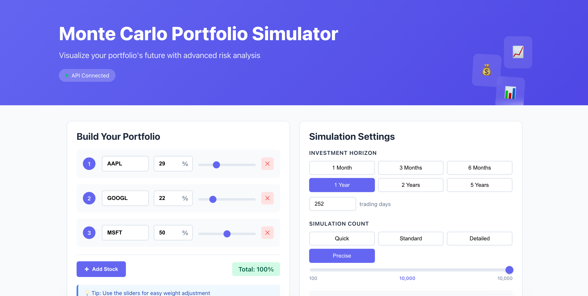
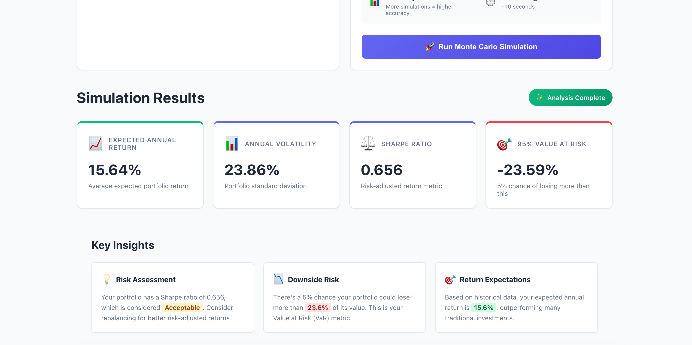
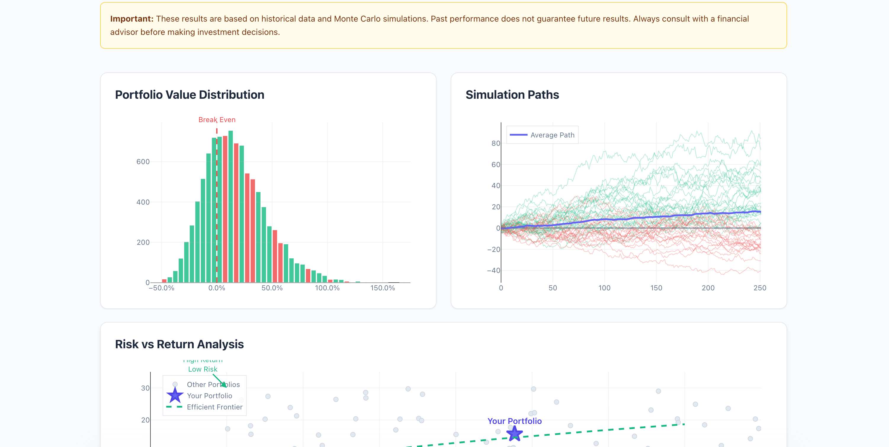

# Monte Carlo Portfolio Simulator 📈

A sophisticated web application that leverages Monte Carlo simulation techniques to analyze portfolio risk and returns, providing investors with probabilistic insights into their investment strategies.


## 🌟 Overview

The Monte Carlo Portfolio Simulator is a powerful financial analysis tool that helps investors understand the potential future performance of their investment portfolios. By running thousands of simulations based on historical data, it provides a probabilistic view of possible outcomes, enabling better-informed investment decisions.

### Why Monte Carlo Simulation?

Traditional portfolio analysis often relies on single-point estimates, which fail to capture the full range of possible outcomes. Monte Carlo simulation addresses this by:
- Generating thousands of possible future scenarios
- Accounting for the randomness inherent in financial markets
- Providing probability distributions rather than single estimates
- Helping investors understand both upside potential and downside risks

## 🎯 Key Features

### Portfolio Management
- **Dynamic Stock Selection**: Add up to 10 stocks to your portfolio
- **Intuitive Weight Allocation**: Visual sliders and percentage inputs for precise control
- **Auto-Balance Function**: Automatically normalize weights to 100%
- **Real-Time Validation**: Instant feedback on portfolio composition

### Simulation Engine
- **Configurable Time Horizons**: From 1 month to 5 years
- **Scalable Simulations**: Run 100 to 10,000 Monte Carlo paths
- **Historical Data Integration**: Leverages real market data via Polygon.io API
- **Multivariate Modeling**: Accounts for correlations between assets

### Visualizations
- **Distribution Charts**: Histogram of final portfolio values
- **Simulation Paths**: Visual representation of potential portfolio trajectories
- **Risk-Return Scatter**: Compare your portfolio against the efficient frontier
- **Interactive Plots**: Powered by Plotly.js for detailed exploration

### Risk Analytics
- **Expected Return**: Annualized expected portfolio return
- **Volatility**: Annual standard deviation of returns
- **Value at Risk (VaR)**: 95% confidence interval for maximum loss
- **Sharpe Ratio**: Risk-adjusted performance metric

## 📸 Screenshots

<p align="center">




</p>

## 📐 Mathematical Foundation

### Portfolio Return Calculation
The expected portfolio return is calculated as:

```
E(Rp) = Σ(wi × E(Ri))
```

Where:
- `E(Rp)` = Expected portfolio return
- `wi` = Weight of asset i
- `E(Ri)` = Expected return of asset i

### Portfolio Volatility
Portfolio volatility accounts for correlations between assets:

```
σp = √(wᵀ × Σ × w)
```

Where:
- `σp` = Portfolio standard deviation
- `w` = Vector of asset weights
- `Σ` = Covariance matrix of asset returns

### Sharpe Ratio
The Sharpe ratio measures risk-adjusted returns:

```
Sharpe Ratio = E(Rp) / σp
```

*Note: We assume a risk-free rate of 0 for simplicity*

### Monte Carlo Simulation Process
1. **Calculate Historical Statistics**: Mean returns (μ) and covariance matrix (Σ)
2. **Generate Random Returns**: Sample from multivariate normal distribution N(μ, Σ)
3. **Simulate Price Paths**: For each simulation, calculate cumulative returns
4. **Analyze Results**: Compute statistics from the distribution of final values

### Value at Risk (VaR)
95% VaR represents the loss threshold that will not be exceeded with 95% confidence:

```
VaR₉₅ = Percentile(Returns, 5%)
```

## 🛠️ Tech Stack

### Backend
- **FastAPI**: Modern, fast web framework for building APIs
- **NumPy**: Numerical computing for matrix operations
- **Pandas**: Data manipulation and analysis
- **SciPy**: Statistical computations
- **Polygon.io API**: Real-time and historical market data

### Frontend
- **React 18**: Component-based UI framework
- **Plotly.js**: Interactive data visualization
- **Axios**: HTTP client for API communication
- **CSS3**: Modern styling with animations

## 🚀 Getting Started

### Prerequisites
- Python 3.8+
- Node.js 14+
- npm or yarn
- Polygon.io API key (free tier available)

### Installation

1. **Clone the repository**
```bash
git clone https://github.com/yourusername/portfolio-monte-carlo.git
cd portfolio-monte-carlo
```

2. **Backend Setup**
```bash
# Navigate to backend directory
cd backend

# Create virtual environment
python -m venv venv

# Activate virtual environment
# On Windows:
venv\Scripts\activate
# On macOS/Linux:
source venv/bin/activate

# Install dependencies
pip install -r requirements.txt
```

3. **Environment Configuration**

Create a `.env` file in the `backend` directory:

```bash
# Navigate to backend directory
cd backend

# Create .env file
touch .env  # On Windows: type nul > .env
```

Add the following content to `backend/.env`:

```env
# API Configuration
POLYGON_API_KEY=your_polygon_api_key_here

# Server Configuration
BACKEND_PORT=8000

# Redis Configuration (optional - for caching)
REDIS_URL=redis://localhost:6379

# CORS Settings (optional)
ALLOWED_ORIGINS=http://localhost:3000,http://localhost:3001

# Environment
ENVIRONMENT=development
```

**Getting a Polygon.io API Key:**
1. Visit [Polygon.io](https://polygon.io)
2. Click "Get your Free API Key"
3. Sign up for a free account
4. Copy your API key from the dashboard
5. Replace `your_polygon_api_key_here` with your actual key

4. **Frontend Setup**
```bash
# Navigate to frontend directory
cd ../frontend

# Install dependencies
npm install
```

5. **Frontend Environment Configuration**

Create a `.env` file in the `frontend` directory:

```bash
# Navigate to frontend directory
cd frontend

# Create .env file
touch .env  # On Windows: type nul > .env
```

Add the following content to `frontend/.env`:

```env
# API URL - Point to your backend
REACT_APP_API_URL=http://localhost:8000

# Optional: For production deployment
# REACT_APP_API_URL=https://your-backend-url.com

# Optional: Google Analytics (if you want to track usage)
# REACT_APP_GA_TRACKING_ID=UA-XXXXXXXXX-X

# Optional: Feature flags
REACT_APP_ENABLE_ANALYTICS=false
REACT_APP_MAX_STOCKS=10
REACT_APP_MAX_SIMULATIONS=10000
```

### Project Structure with Environment Files

```
portfolio-monte-carlo/
├── backend/
│   ├── .env                 # Backend environment variables
│   ├── .env.example         # Example environment file
│   ├── app.py
│   ├── config.py
│   ├── requirements.txt
│   ├── models/
│   ├── services/
│   └── utils/
├── frontend/
│   ├── .env                 # Frontend environment variables
│   ├── .env.example         # Example environment file
│   ├── package.json
│   ├── public/
│   └── src/
└── README.md
```

### Creating Example Environment Files

It's good practice to create `.env.example` files to help other developers:

**backend/.env.example:**
```env
# Get your free API key from https://polygon.io
POLYGON_API_KEY=your_polygon_api_key_here

# Backend server configuration
BACKEND_PORT=8000

# Optional: Redis for caching (not required for basic functionality)
REDIS_URL=redis://localhost:6379

# CORS configuration
ALLOWED_ORIGINS=http://localhost:3000

# Environment: development, staging, or production
ENVIRONMENT=development
```

**frontend/.env.example:**
```env
# Backend API URL
REACT_APP_API_URL=http://localhost:8000

# Optional configuration
REACT_APP_ENABLE_ANALYTICS=false
REACT_APP_MAX_STOCKS=10
REACT_APP_MAX_SIMULATIONS=10000
```

### Running the Application

1. **Start the Backend**
```bash
cd backend
# Make sure virtual environment is activated
uvicorn app:app --reload
```
The API will be available at `http://localhost:8000`

2. **Start the Frontend**
```bash
# In a new terminal
cd frontend
npm start
```
The application will open at `http://localhost:3000`

### Verifying Environment Setup

1. **Check Backend Configuration:**
   - Visit `http://localhost:8000/health`
   - Should return: `{"status": "healthy", "api_key_set": true}`

2. **Check Frontend Connection:**
   - Open browser console (F12)
   - Should see: "API Connected" in the UI header

### API Documentation
Once the backend is running, visit `http://localhost:8000/docs` for interactive API documentation.

## 🔒 Security Notes

- **Never commit `.env` files to version control**
- Add `.env` to your `.gitignore` file
- Use environment-specific files for different deployments:
  - `.env.development`
  - `.env.staging`
  - `.env.production`
- Rotate API keys regularly
- Use secrets management services in production (AWS Secrets Manager, HashiCorp Vault)

## 📊 Usage Guide

1. **Build Your Portfolio**
   - Enter stock tickers (e.g., AAPL, GOOGL, MSFT)
   - Adjust weights using sliders or input fields
   - Ensure total weight equals 100%

2. **Configure Simulation**
   - Select investment horizon (1 month to 5 years)
   - Choose number of simulations (more = higher accuracy)
   - Click "Run Monte Carlo Simulation"

3. **Interpret Results**
   - **Expected Return**: Average annualized return across all simulations
   - **Volatility**: Measure of portfolio risk
   - **Sharpe Ratio**: Higher is better (> 1 is good, > 2 is excellent)
   - **95% VaR**: Maximum loss with 95% confidence

## 🧪 API Endpoints

| Endpoint | Method | Description |
|----------|--------|-------------|
| `/` | GET | API welcome message |
| `/health` | GET | Health check endpoint |
| `/simulate` | POST | Run Monte Carlo simulation |

### Sample Request
```json
POST /simulate
{
  "portfolio": {
    "stocks": [
      {"ticker": "AAPL", "weight": 0.4},
      {"ticker": "GOOGL", "weight": 0.3},
      {"ticker": "MSFT", "weight": 0.3}
    ]
  },
  "days": 252,
  "simulations": 1000
}
```

## 🚦 Rate Limits

- Polygon.io Free Tier: 5 API calls per minute
- The application implements a 12-second delay between stock data fetches
- For portfolios with many stocks, expect longer loading times

## 🐛 Troubleshooting

### Common Issues

1. **"No data found for [TICKER]"**
   - Verify the ticker symbol is correct
   - Ensure the stock is actively traded
   - Check if markets were open during the requested period

2. **Rate Limit Errors**
   - Wait 60 seconds before retrying
   - Consider upgrading your Polygon.io plan
   - Reduce the number of stocks in your portfolio

3. **CORS Errors**
   - Ensure backend is running on the correct port
   - Check that frontend `.env` points to the right backend URL
   - Verify ALLOWED_ORIGINS in backend `.env` includes your frontend URL

4. **Environment Variable Issues**
   - Ensure `.env` files are in the correct directories
   - Restart servers after changing environment variables
   - Check for typos in variable names
   - Verify no quotes around values in `.env` files

## 🚀 Deployment

### Backend Deployment (Render)
1. Set environment variables in Render dashboard
2. Deploy from GitHub repository

### Frontend Deployment (Vercel)
1. Set `REACT_APP_API_URL` to your production backend URL
2. Deploy from GitHub repository

## 📈 Future Enhancements

- [ ] Portfolio optimization (maximize Sharpe ratio)
- [ ] Support for cryptocurrencies and commodities
- [ ] Historical backtesting capabilities
- [ ] PDF export functionality
- [ ] User authentication and portfolio saving
- [ ] Risk parity allocation strategies
- [ ] Factor-based analysis
- [ ] Stress testing scenarios

## 🤝 Contributing

Contributions are welcome! Please feel free to submit a Pull Request.

1. Fork the repository
2. Create your feature branch (`git checkout -b feature/AmazingFeature`)
3. Commit your changes (`git commit -m 'Add some AmazingFeature'`)
4. Push to the branch (`git push origin feature/AmazingFeature`)
5. Open a Pull Request

## 📝 License

This project is licensed under the MIT License - see the [LICENSE](LICENSE) file for details.

## 🙏 Acknowledgments

- [Polygon.io](https://polygon.io) for providing market data
- [Plotly](https://plotly.com) for visualization tools
- The quantitative finance community for mathematical foundations

---

Built with ❤️ by Utsav Doshi